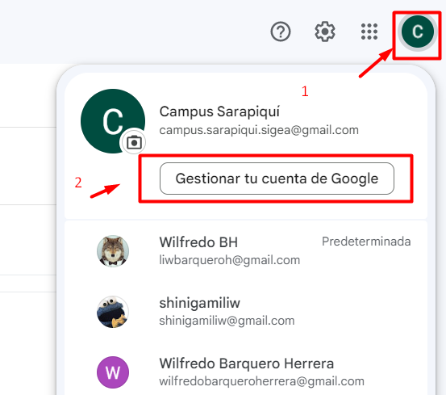
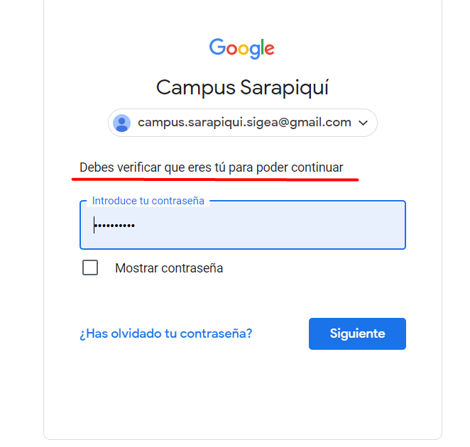
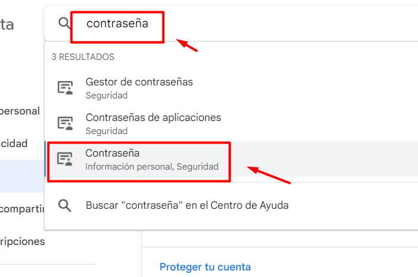
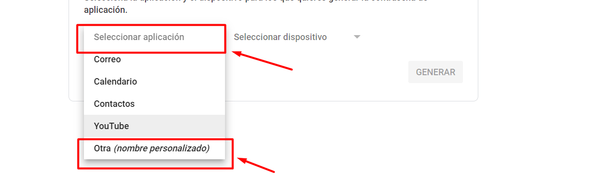
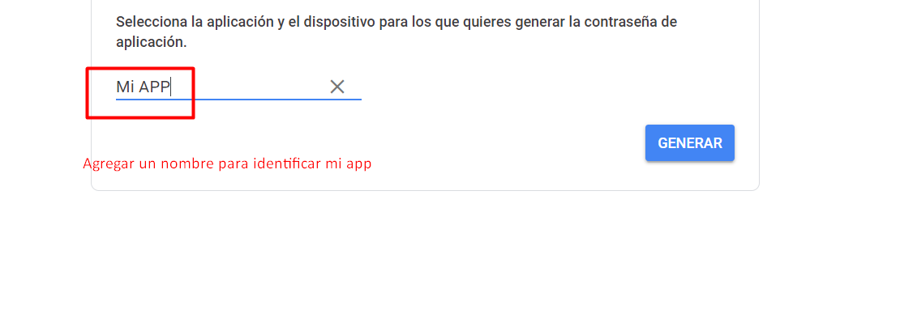
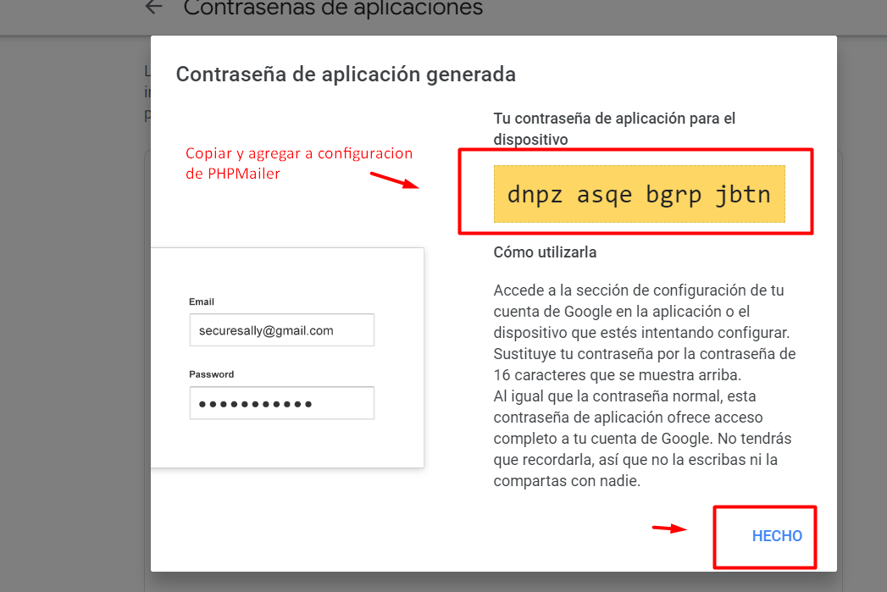

# Sistema de Gestion de Activos

Sistema desarrollado por estudiantes de la Universidad Nacional de Costa Rica.

### Backend - API SIGEA

### Dependencias 

* PHPMailer
  - Instalacion: Manual, sin composer
  - Uso: Utilizda para el envio de correos electronicos
  - Documentacion :  https://github.com/PHPMailer/PHPMailer
  - Implemantacion: 
  se debe descargar y colocarlo en la carpeta de librerias del proyecto,
  se debe incluir los archivos: Exception.php, PHPMailer.php, SMTP.php, POP3.php, OAuth.php.
  En un carpeta dentro se crear una archivo que realiza todas las importaciones de las librerias,
  y una funcion que tiene todas las configuraciones de envio de correos.

### Configuraciones

* GMAIL: Se crea un correo electronico de gmail para el envio de correos, se debe habilitar el uso
de utilizar contraseñas de aplicación. 

### Tutoriales

* Crear contraseña de aplicacion gmail
https://youtu.be/n0Fia1PmBy4
 
* Configurar PHPMailer
https://youtu.be/QT6FxKdxGkE
  
### BUG
